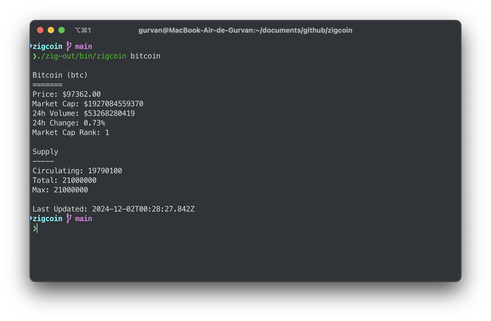

# ZigCoin

A fast and minimal CLI cryptocurrency information tool written in Zig, using the CoinGecko API v3.



## Features

- Fetch real-time cryptocurrency price data
- Display market information including:
  - Current price
  - Market cap
  - 24h volume
  - Price changes
  - Supply information
- Clean and minimal CLI output
- Zero configuration needed

## Prerequisites

- Zig 0.11.0 or later
- libcurl development files

### Installing Dependencies

#### Ubuntu/Debian

```bash
sudo apt-get install libcurl4-openssl-dev
```

#### macOS

```bash
brew install curl
```

## Building

```bash
zig build
```

## Running

```bash
./zig-out/bin/zigcoin <coin-id>
```

Examples:

```bash
./zig-out/bin/zigcoin bitcoin
./zig-out/bin/zigcoin ethereum
./zig-out/bin/zigcoin dogecoin
```

## Error Handling

The tool provides clear error messages for common issues:

- Invalid coin ID
- Network request failures
- API rate limiting
- Missing data

## Project Structure

```bash
src/
├── main.zig    - Entry point and argument handling
├── api.zig     - CoinGecko API client implementation
├── types.zig   - Data structures and types
├── json.zig    - JSON response parsing
└── display.zig - Output formatting and display
```

## Contributing

1. Fork the repository
2. Create your feature branch
3. Commit your changes
4. Push to the branch
5. Create a Pull Request

## License

This project is licensed under the MIT License - see the LICENSE file for details.

## Acknowledgments

- CoinGecko API for providing the cryptocurrency data
- Zig community
- libcurl for HTTP requests

## Known Limitations

- Currently only supports single coin queries
- Requires internet connection
- Subject to CoinGecko API rate limits
